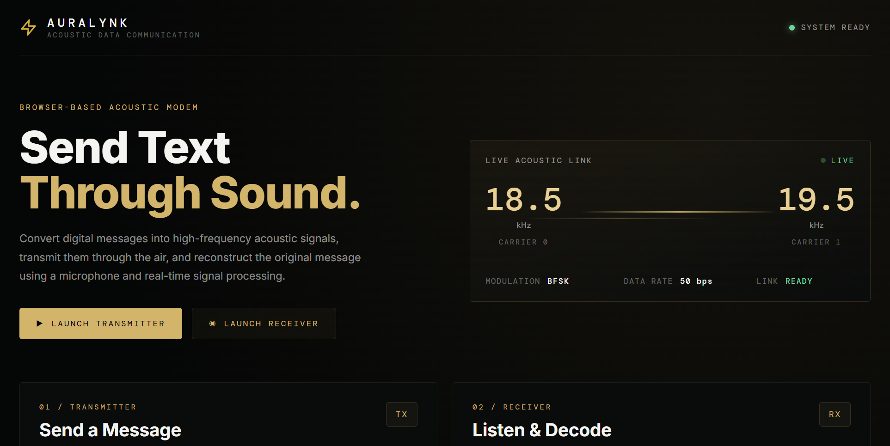
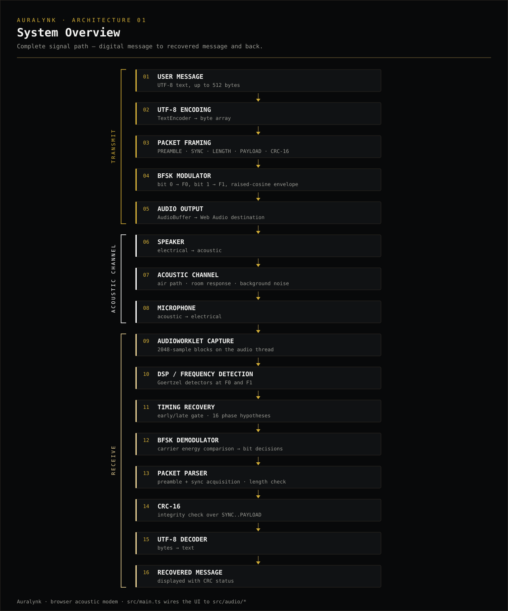
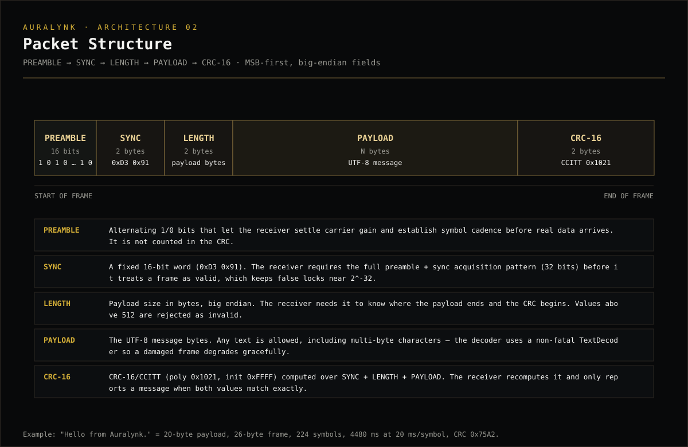
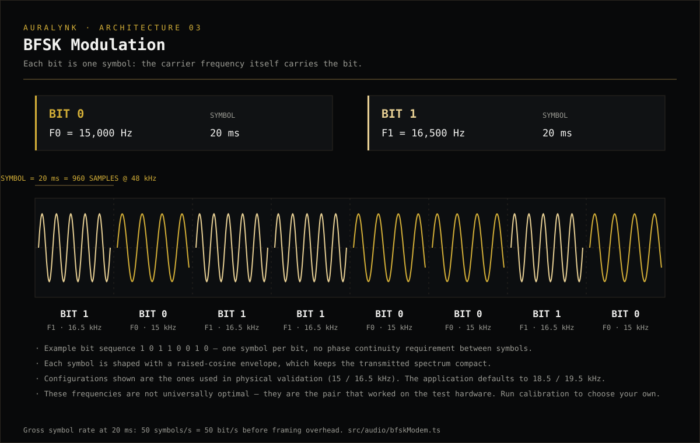
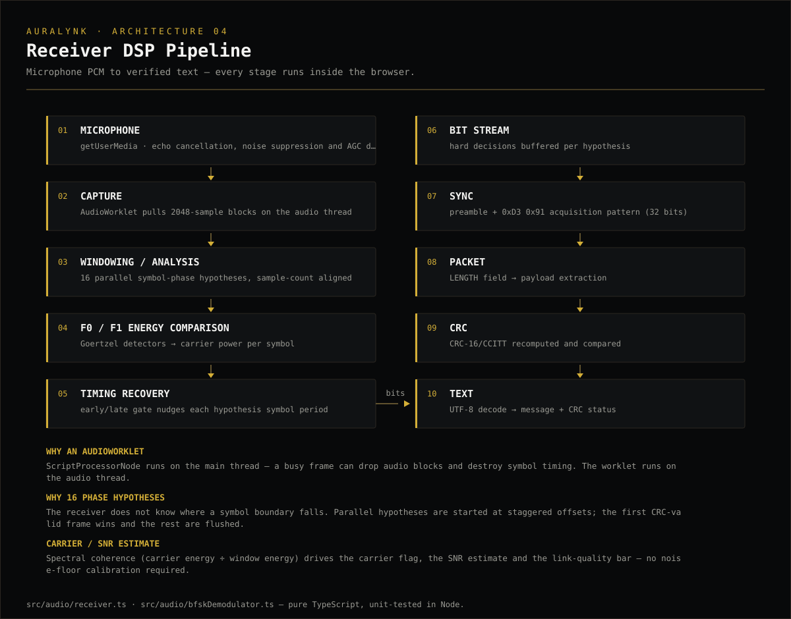
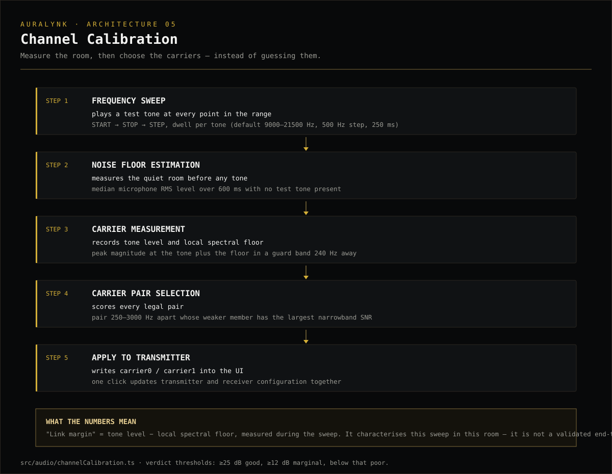
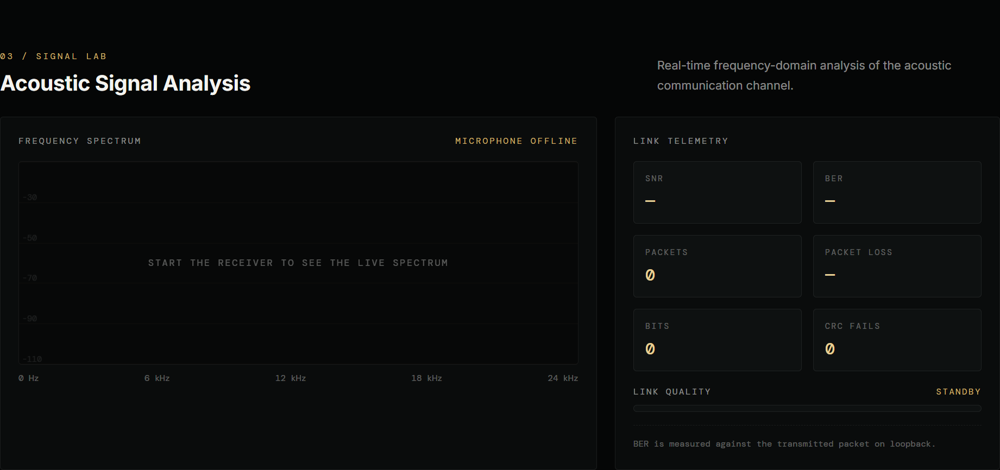
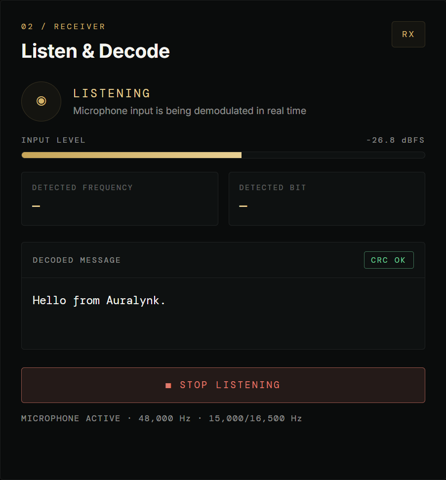
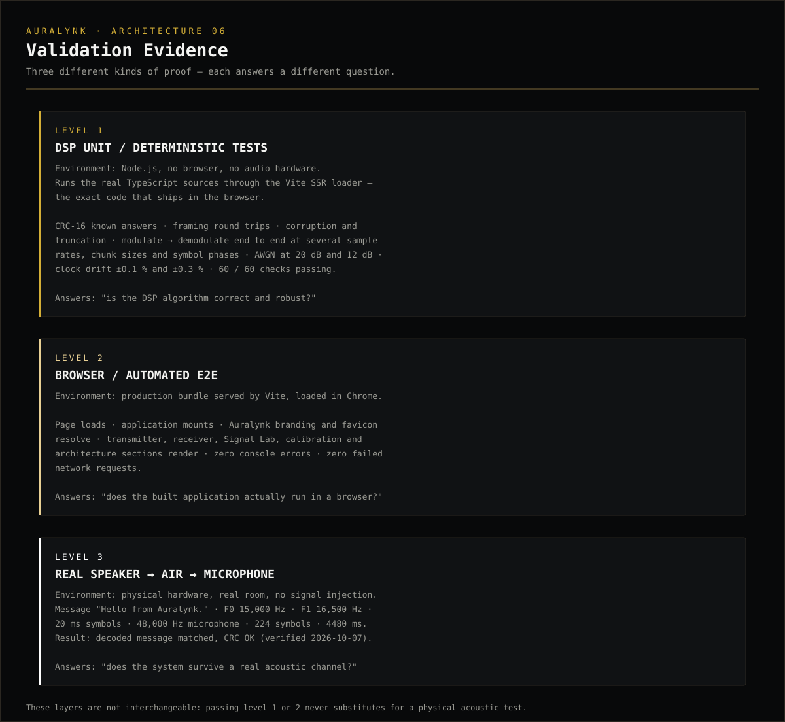

# Auralynk — Acoustic Data Communication

A browser-based acoustic data communication system: text becomes BFSK sound, travels through the air from a speaker, and is reconstructed from a microphone signal with real-time DSP and packet integrity verification.




**🌐 Live Demo:** https://rishivexe-alt.github.io/Auralynk/

---

## Overview

Auralynk is a browser-based acoustic data communication system that converts digital messages into binary frequency-shift keyed acoustic signals, transmits them through a speaker-to-air channel, captures the signal through a microphone, and reconstructs the original message using real-time digital signal processing and packet integrity verification.

Everything runs inside a modern browser: modulation, framing, microphone capture, carrier detection, timing recovery, demodulation and CRC verification. There is no server component, no native code, and no runtime dependency — the entire modem is TypeScript, Web Audio and math.

## Why Auralynk?

The project explores how principles from digital communication, embedded signal processing, audio systems, and real-time computing can be implemented directly inside a modern browser without requiring specialized RF hardware.

A loudspeaker and a microphone already form a complete radio alternative: a baseband-ish channel with real bandwidth, real noise, real multipath from room reflections, and real clock drift between two independent audio devices. That makes an acoustic link a compact, observable version of the problems every communication system has to solve — framing, synchronization, detection, integrity checking — and the browser gives you a microphone, a speaker and an audio thread with one API.

### Engineering approach

I approach communication systems by understanding the signal path rather than treating the implementation as a black box. Auralynk was developed by tracing the complete path from digital data and packet framing through BFSK modulation, acoustic transmission, microphone capture, digital detection, timing recovery, demodulation, and CRC verification. Every stage in that chain is a separate, inspectable piece of the codebase — and every stage has a corresponding test or measurement.

## Key Features

- **BFSK modem** — binary frequency-shift keying with a raised-cosine envelope per symbol, configurable carriers (200 Hz – 22 kHz) and symbol time (5 – 500 ms).
- **Framed packets** — `PREAMBLE → SYNC → LENGTH → PAYLOAD → CRC-16`, one shared implementation used by both transmitter and receiver.
- **CRC-16/CCITT integrity check** — a message is only ever displayed when the recomputed CRC matches the received value exactly.
- **AudioWorklet capture** — microphone PCM is pulled on the audio thread in 2048-sample blocks, so main-thread work cannot corrupt symbol timing.
- **Symbol-timing recovery** — an early/late gate that tracks the transmitter's clock, with 16 parallel symbol-phase hypotheses for initial acquisition.
- **Goertzel carrier detection** — per-symbol energy comparison at F0/F1 with a coherence-based carrier flag and SNR estimate.
- **Signal Lab** — live spectrum, carrier markers, input level, packet counters and loopback BER.
- **Channel calibration** — a tone sweep that measures the room, scores candidate carrier pairs, and applies the recommendation to the transmitter.
- **UTF-8 payloads up to 512 bytes** — multi-byte text round-trips unchanged.
- **50 bit/s gross** at the default 20 ms symbol time — a low-data-rate experimental modem, by design.
- **Zero runtime dependencies** — `typescript` and `vite` are the only packages in the project.

## System Architecture



The application is split deliberately:

| Layer | Responsibility |
| --- | --- |
| `src/main.ts` | UI state, event wiring, telemetry rendering. No DSP. |
| `src/appTemplate.ts` | Page markup, kept separate from logic. |
| `src/audio/bfskModem.ts` | Single source of truth for framing, CRC, bit ordering and modulation. |
| `src/audio/bfskDemodulator.ts` | Pure TypeScript receiver DSP — no Web Audio dependency, unit-testable in Node. |
| `src/audio/transmitter.ts` | Renders packets to an `AudioBuffer` and plays them, with cancellable playback. |
| `src/audio/receiver.ts` | AudioWorklet capture feeding the demodulator. |
| `src/audio/microphoneAnalyzer.ts` | Single owner of the microphone stream and analyser. |
| `src/audio/channelCalibration.ts` | Tone sweep, measurement and carrier-pair selection. |
| `src/audio/audioEngine.ts` | Single shared output `AudioContext` for transmissions, sweeps and test tones. |

## End-to-End Signal Path

```
USER MESSAGE
   ↓  UTF-8 encoding
PACKET FRAMING   (preamble · sync · length · payload · CRC-16)
   ↓  BFSK modulation  (bit → carrier frequency, 20 ms symbols)
AUDIO OUTPUT     (AudioBuffer → Web Audio destination)
   ↓
SPEAKER → ACOUSTIC CHANNEL → MICROPHONE
   ↓
AUDIOWORKLET CAPTURE   (2048-sample blocks, audio thread)
   ↓
DSP / FREQUENCY DETECTION   (Goertzel energy at F0 and F1)
   ↓
TIMING RECOVERY   (early/late gate, 16 phase hypotheses)
   ↓
BFSK DEMODULATOR   (bit decisions)
   ↓
PACKET PARSER   (preamble + sync acquisition → length → payload)
   ↓
CRC-16   (verify → only then display)
   ↓
UTF-8 DECODER → RECOVERED MESSAGE
```

## How the Communication Works

### 1. Message Input
The message is typed into the transmitter panel. A live counter shows its UTF-8 size against the 512-byte payload limit, and the packet preview shows the exact frame size, symbol count, on-air duration and CRC value that will be produced.

### 2. UTF-8 Encoding
`TextEncoder` converts the string to bytes, so non-ASCII text is transmitted unchanged. Emoticons, accented characters and CJK text are all valid payloads — the test suite round-trips them explicitly.

### 3. Packet Framing
The bytes are wrapped in a frame: a 16-bit alternating preamble, the sync word `0xD3 0x91`, a big-endian 2-byte length, the payload, and a 2-byte CRC-16 over everything from sync through payload. Framing turns an unbounded bit stream into something the receiver can find, delimit and verify.

### 4. BFSK Modulation
Each bit becomes one symbol: `0 → F0`, `1 → F1`. Symbols are rendered as PCM samples with a raised-cosine envelope per symbol, which keeps the transmitted spectrum compact and avoids harsh switching transients.

### 5. Acoustic Translation
The rendered buffer is played through the browser's audio output. The signal now exists as pressure waves — subject to the speaker's frequency response, the room, ambient noise and distance.

### 6. Microphone Capture
`getUserMedia` opens the microphone with echo cancellation, noise suppression and automatic gain control all disabled, because each of them would distort a signal that must be measured, not "improved". Samples are pulled by an `AudioWorklet` running on the audio thread and posted to the demodulator in 2048-sample blocks.

### 7. Frequency Detection
Inside every symbol window, two Goertzel detectors measure the energy at F0 and F1. The larger one wins, producing a hard bit decision. The ratio of carrier energy to total window energy also yields a coherence value used for carrier detection and the SNR estimate.

### 8. Symbol Timing Recovery
The receiver does not know where symbol boundaries fall, and the two devices do not share a clock. Sixteen phase hypotheses start at staggered sample offsets; each runs an early/late timing loop that nudges its symbol period toward alignment. The first hypothesis that produces a CRC-valid frame wins, and the others are flushed.

### 9. Demodulation
Hard bits stream into a per-hypothesis buffer. The receiver hunts for the full 32-bit acquisition pattern (preamble + sync) before it begins parsing, then reads the length field and waits for the remaining payload and CRC bits to arrive.

### 10. CRC Verification
`CRC-16/CCITT` (poly `0x1021`, init `0xFFFF`) is recomputed over the received frame and compared byte-for-byte with the received CRC. Mismatches are counted and the parser slides forward one bit to resync — a corrupted message is never displayed as good data.

### 11. Message Reconstruction
On a CRC match, the payload bytes go through `TextDecoder` and the UI shows the recovered text with a `CRC OK` badge, alongside packet, bit and integrity counters.

## Packet Structure



```
┌──────────┬──────┬────────┬────────────┬─────────┐
│ PREAMBLE │ SYNC │ LENGTH │   PAYLOAD  │ CRC-16  │
│ 16 bits  │ 2 B  │  2 B   │   N ≤ 512  │  2 B    │
└──────────┴──────┴────────┴────────────┴─────────┘
```

| Field | Size | Why it exists |
| --- | --- | --- |
| **PREAMBLE** | 16 bits (`1010…10`) | Gives the receiver a run of transitions to settle on before real data starts, and makes false frame starts overwhelmingly unlikely when combined with the sync word. |
| **SYNC** | 2 bytes (`0xD3 0x91`) | A fixed marker that can never be confused with payload. The receiver matches preamble + sync together — 32 bits — before it trusts a frame start. |
| **LENGTH** | 2 bytes, big endian | Tells the receiver where the payload ends and the CRC begins. Values above 512 are rejected immediately as invalid. |
| **PAYLOAD** | N bytes | The UTF-8 message. Any byte sequence is legal. |
| **CRC-16** | 2 bytes | CRC-16/CCITT over `SYNC + LENGTH + PAYLOAD`. The receiver recomputes it and requires an exact match before displaying anything. |

The preamble is bit-level and excluded from the CRC; the CRC covers exactly the bytes from sync to the end of the payload. Total overhead is 16 bits + 6 bytes.

## BFSK Modulation



Binary symbols are represented by two carrier frequencies:

| Symbol | Carrier | Physical-test value |
| --- | --- | --- |
| bit `0` | F0 | **15,000 Hz** |
| bit `1` | F1 | **16,500 Hz** |
| symbol duration | — | **20 ms** (50 symbols/s) |

These are the values used in the successful physical validation described below — not a claim that they are universally optimal for every speaker, microphone or room. Every acoustic channel has its own response: laptop speakers roll off at high frequencies, and microphone sensitivity varies. The application defaults to **18.5 kHz / 19.5 kHz**, and the Channel Calibration tool exists precisely because the right pair is something you *measure*, not something you assume.

The transmitter validates both carriers against the device Nyquist limit before playing, so an impossible configuration is rejected rather than silently producing no output.

## Receiver DSP Pipeline



```
MICROPHONE
  → AUDIOWORKLET CAPTURE        (2048-sample blocks, audio thread)
  → WINDOWING / ANALYSIS        (per-symbol windows, 16 phase hypotheses)
  → F0 / F1 ENERGY COMPARISON   (Goertzel detectors)
  → TIMING RECOVERY             (early/late gate)
  → BIT STREAM                  (hard decisions per hypothesis)
  → SYNC                        (preamble + 0xD3 0x91 acquisition)
  → PACKET                      (length → payload)
  → CRC                         (CRC-16/CCITT verification)
  → TEXT                        (UTF-8 decode → message)
```

Two design choices matter more than the rest:

- **AudioWorklet, not `ScriptProcessorNode`.** The legacy node runs on the main thread, so a canvas redraw or DOM update could drop an audio block — and a missing block permanently desynchronises symbol timing. The worklet runs on the audio thread; when an input channel is missing it still contributes its render quantum of silence so the sample-count grid never drifts.
- **Parallel phase hypotheses.** Symbol boundaries are unknown *a priori* and only one hypothesis can be right. Running sixteen staggered candidates in parallel costs little next to the guarantee that at least one of them is correctly aligned.

## Timing Recovery

Each hypothesis integrates its symbol in two halves. At a bit transition, a misplaced window boundary lets the opposite carrier leak into one half, and the amount of that leak is proportional to the timing error. The early/late loop converts that leak into a small correction of the hypothesis's tracked symbol period, clamped to ±10 % of nominal, so the receiver follows the transmitter's clock instead of assuming it.

Halves where the leak is negligible (flat bit runs, silence, noise) are ignored, which keeps the loop from random-walking when there is no timing information present.

**Verified range:** the deterministic suite resamples transmitted waveforms to emulate a transmitter clock offset and confirms lock at **±0.1 % and ±0.3 %** drift. Drift beyond that has not been characterised.

## Channel Calibration



Calibration answers one question: *which two frequencies should this machine actually use?*

1. **Noise floor estimation** — with no tone playing, the microphone level is sampled for 600 ms and the median RMS in dBFS is recorded.
2. **Frequency sweep** — a test tone is played at each point of the configured range (default 9000 → 21500 Hz, 500 Hz step, 250 ms dwell), measuring the received level at every frequency.
3. **Carrier measurement** — for each tone, the peak spectral magnitude at the tone is recorded together with the *local* spectral floor in a guard band 240 Hz away. The local floor is what the Goertzel detector actually competes against, so pairs are scored on narrowband SNR (tone level − local floor) rather than on tone level alone.
4. **Carrier-pair selection** — every legal pair (250 – 3000 Hz apart) is scored by its *weaker* member; the best pair wins. A verdict of good / marginal / poor is derived from that worst-case margin (≥ 25 dB, ≥ 12 dB, below that).
5. **Apply to transmitter** — one click writes the recommendation into the carrier inputs, updating both transmitter and receiver.

**Important:** the reported "link margin" is a sweep-time measurement of tone level against the local spectral floor *in that room, at that moment*. It characterises the measurement — it is not a validated end-to-end link budget, and the verdict thresholds are heuristics, not proven performance boundaries. Treat the recommendation as a well-founded starting point and let the packet results be the final word.

## Signal Lab



| Metric | What it actually measures |
| --- | --- |
| **Frequency spectrum** | Live FFT (`fftSize 4096`, no smoothing) of the microphone input, with F0/F1 markers overlaid and the axis scaled to the device's Nyquist frequency. |
| **Input level** | RMS level of the microphone signal in dBFS. |
| **SNR** | Estimated from spectral coherence — carrier energy ÷ total symbol-window energy — converted to decibels and clamped to −10…+30 dB. Shown only while a carrier is detected. It is an in-band estimate for the current window, not a channel measurement. |
| **BER** | Bit-error rate of the last decoded frame against the packet that *this tab* transmitted (a loopback reference installed for the duration of a transmission). Meaningful only when transmitter and receiver run on the same machine; otherwise it reads `—`. |
| **Packets** | Count of decoded frames. |
| **Packet loss** | Share of carrier bursts that ended (250 ms without carrier) without producing a decoded frame. |
| **Bits** | Cumulative symbol decisions across all parallel phase hypotheses since listening started — not unique payload bits. |
| **CRC fails** | Candidate frames rejected during acquisition (impossible length or CRC mismatch). Rejected candidates are part of normal operation in noise, not "lost messages". |
| **Link quality bar** | A display mapping of the SNR estimate to 0 – 100 %. Informational only. |

## Physical Validation

The strongest result is an end-to-end transmission over a real acoustic channel — speaker, air, microphone, no signal injection:

| | |
| --- | --- |
| **Message** | `Hello from Auralynk.` |
| **Carrier 0 (F0)** | 15,000 Hz |
| **Carrier 1 (F1)** | 16,500 Hz |
| **Symbol duration** | 20 ms (224 symbols, 4480 ms on air) |
| **Sample rate** | 48,000 Hz |
| **Result** | Decoded successfully |
| **Integrity** | **CRC OK** |

This configuration was validated physically during development and validated again on **2026-10-07** while preparing this repository; the machine-generated report from the second run is stored at [`docs/testing/physical-loopback-2026-10-07.json`](docs/testing/physical-loopback-2026-10-07.json) and the resulting UI capture is:



No distance, SNR, BER or range figure is claimed for the acoustic link: those were not characterised as part of this validation.

## Verification

Evidence lives in [`docs/testing/`](docs/testing/) and is deliberately separated into three non-interchangeable levels:



### 1. Deterministic DSP tests — `npm test`

Runs in Node against the real TypeScript sources (via Vite's SSR loader), covering CRC known answers, framing round trips, corruption/truncation, modulate → demodulate across sample rates, chunk sizes and symbol phases, AWGN at 20 dB and 12 dB, and clock drift of ±0.1 % / ±0.3 %.

**60 / 60 passing** — full output: [`docs/testing/dsp-test-output.txt`](docs/testing/dsp-test-output.txt)

### 2. Browser end-to-end — `npm run build` + `npm run preview`

The production bundle is loaded in Chrome and asserted on: page title, Auralynk branding, favicon, application mount, all sections and canvases, zero failed network requests, **zero console errors**.

Output: [`docs/testing/browser-e2e-output.txt`](docs/testing/browser-e2e-output.txt)

### 3. Physical acoustic validation — real speaker → air → microphone

The result in the previous section: a real message transmitted through the room and decoded with CRC OK, captured in `physical-loopback-2026-10-07.json` and `06-physical-validation.png`.

These are three different forms of evidence. Levels 1 and 2 say the algorithm and the bundle are correct; only level 3 says the system survives a real acoustic channel.

## Cross-Platform Setup

Auralynk is a static web application. **It does not require Python, MATLAB, ROS, SDR hardware or any native toolchain** — only Node.js, npm and a browser.

### Requirements

| | |
| --- | --- |
| **Node.js** | `^20.19.0` or `>=22.12.0` (Vite 8 requirement) |
| **npm** | ships with Node.js |
| **Browser** | modern browser with Web Audio, `AudioWorklet` and `getUserMedia` (Chrome / Edge / Firefox / Safari 14.1+) |
| **Microphone permission** | required for the receiver and calibration — the browser prompts on first use |
| **For physical transmission** | speaker + microphone + a quiet-enough room + permission granted |

The application is a secure-context user of the microphone: `localhost` works out of the box, and any HTTPS host (GitHub Pages, Vercel, Netlify) works in production.

### Commands

```bash
npm install       # install dependencies
npm run check     # DSP tests + typecheck + production build
npm run dev       # start the dev server → http://localhost:5173
```

```bash
npm test          # deterministic DSP suite only
npm run build     # typecheck + production bundle → dist/
npm run preview   # serve the production bundle locally
```

### Platform notes

- **Windows** — validated on Windows 11 with Chrome; physical speaker-to-microphone testing was performed on this platform.
- **macOS** — `npm install && npm run dev` works unchanged; grant microphone permission in the browser prompt (System Settings → Privacy → Microphone if the browser itself has not been granted access).
- **Linux** — same commands; ensure a PulseAudio/PipeWire microphone is available to the browser.

Physical acoustic communication additionally requires suitable audio hardware — some devices roll off above 15 kHz, which changes what calibration will recommend — plus a quiet environment and microphone access granted to the browser.

## Deployment

The build is a fully static bundle (`dist/`) with a **relative base path**, so it can be hosted from any path on any static host — root domain or repository subpath — with no configuration changes.

### GitHub Pages

A workflow is included at [`.github/workflows/deploy-pages.yml`](.github/workflows/deploy-pages.yml): on every push to `main` it runs `npm ci`, `npm run check`, uploads `dist/`, and deploys with the official Pages actions.

One-time setup: **Settings → Pages → Source: GitHub Actions**.

### Vercel / Netlify

No configuration file is required:

| Setting | Value |
| --- | --- |
| Build command | `npm run build` |
| Output directory | `dist` |
| Node version | `22` (or any version matching `engines`) |

### Any static host

Upload the contents of `dist/` — it works from `/` or from `/any/sub/path/`.

None of this affects local development: `npm run dev` serves at `http://localhost:5173` exactly as before.

## Project Structure

```
Auralynk/
├── src/
│   ├── main.ts                 # application controller — UI wiring, telemetry
│   ├── appTemplate.ts          # page markup
│   ├── style.css               # visual system
│   └── audio/
│       ├── bfskModem.ts        # framing, CRC, bit ordering, modulation
│       ├── bfskDemodulator.ts  # receiver DSP (pure TypeScript)
│       ├── transmitter.ts      # packet → AudioBuffer → speakers
│       ├── receiver.ts         # AudioWorklet capture → demodulator
│       ├── microphoneAnalyzer.ts  # single microphone owner
│       ├── channelCalibration.ts  # tone sweep + carrier selection
│       └── audioEngine.ts      # shared output AudioContext
├── scripts/
│   └── verify-dsp.mjs          # deterministic DSP test suite (npm test)
├── public/
│   └── favicon.svg             # gold Zap mark
├── docs/
│   ├── architecture/           # six engineering diagrams (SVG)
│   ├── screenshots/            # captured from the running application
│   ├── testing/                # captured test output and run reports
│   └── demo/                   # demo-recording instructions
├── .github/workflows/
│   ├── ci.yml                  # tests + typecheck + build on push/PR
│   └── deploy-pages.yml        # GitHub Pages deployment
├── index.html
├── vite.config.ts
├── package.json
├── package-lock.json
├── tsconfig.json
├── LICENSE
└── README.md
```

### Key files in detail

- **`src/audio/bfskModem.ts`** — the single source of truth. Packet layout, CRC, bit ordering, validation and modulation live here; transmitter and receiver both import from this file, so there is no second packet implementation to drift out of sync.
- **`src/audio/bfskDemodulator.ts`** — the receiver: Goertzel detection, 16 phase hypotheses, early/late timing recovery, sync acquisition, frame parsing and telemetry. Deliberately free of Web Audio imports so Node can test it directly.
- **`src/audio/transmitter.ts`** — frames and renders a packet, plays it with cancellable, always-cleaned-up playback.
- **`src/audio/receiver.ts`** — builds the `AudioWorklet` capture node from an inline blob module and streams blocks into the demodulator.
- **`src/audio/microphoneAnalyzer.ts`** — the only place the microphone is opened; receiver and calibration both attach to it, so the app never holds two streams.
- **`src/audio/channelCalibration.ts`** — measurement and scoring described above.
- **`src/main.ts`** — DOM, state transitions and the numbers shown on screen; contains no signal processing.

## Engineering Design Decisions

- **Why BFSK?** Non-coherent two-tone detection needs only an energy comparison per symbol — no carrier phase recovery, no equaliser. It is robust against the phase distortions a room introduces, trivially inspectable in a spectrum, and easy to test deterministically.
- **Why packet framing?** A raw bit stream has no boundaries. Framing gives the receiver a way to find the start of a message, know how long it is, and resynchronise after noise — the difference between "some bits arrived" and "this message arrived".
- **Why CRC?** The acoustic channel corrupts data; silence, clicks and interference all produce plausible-looking bits. A CRC is cheap, standard, and lets the receiver guarantee that what it displays is what was sent.
- **Why timing recovery?** Transmitter and receiver run on independent audio clocks. Without a tracking loop, symbol boundaries walk away from the sample grid and frames fall apart mid-transmission — the drift tests exist because this failure mode is real.
- **Why calibration?** Speaker and microphone responses are unknown and device-dependent. Measuring the channel and selecting carriers by measured margin is the difference between a system that works on one laptop and a system you can actually run anywhere.
- **Why Web Audio APIs?** The browser already provides a cross-platform audio path to real hardware, an audio-thread worklet for sample-accurate capture, and a permission model for the microphone — no plugins, no native code, no install step for the end user.

## Limitations

Honest constraints of the current system:

- The acoustic channel is **environment dependent** — background noise, reflections and distance all change results run to run.
- Speaker and microphone **frequency responses vary widely**; above ~15 kHz many consumer devices attenuate sharply, which is why carriers are configurable and calibration exists.
- **Background noise degrades reliability**; the system has no error correction, so a corrupted frame is simply rejected.
- **Browser audio behaviour varies** between engines and devices: sample rate, latency, and how aggressively a device resamples are all outside the application's control.
- This is a **low-data-rate experimental modem** — roughly 50 bit/s gross at the default symbol time — not a replacement for any existing wireless technology.
- Physical range and performance have **not been characterised as a formal RF-style link budget**; the calibration "margin" is a sweep-time measurement, not a proven end-to-end figure.
- Only one modulation mode (BFSK) and one modulation order (binary) are implemented.

## Future Work

Possible directions — **none of these are implemented today**:

- Adaptive modulation and data rate based on measured channel quality.
- Stronger error correction (FEC) so marginal links recover instead of dropping frames.
- Adaptive gain control on the receive path.
- Improved synchronisation (matched-filter acquisition, preamble correlation).
- Automatic carrier selection driven by a standing calibration.
- Longer-distance acoustic testing and multi-device (two separate machines) testing.
- Mobile browser optimisation and touch-first layout work.
- Performance characterisation across a range of microphones, speakers and rooms.


## License

MIT — see [LICENSE](LICENSE).

## Author

**Rishi P.**
